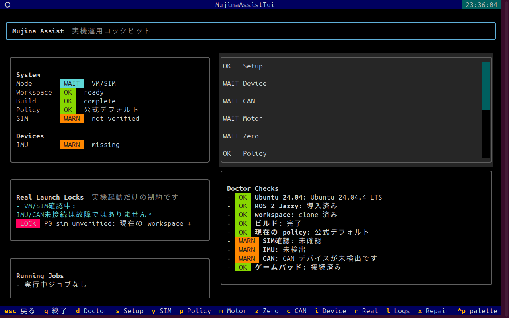
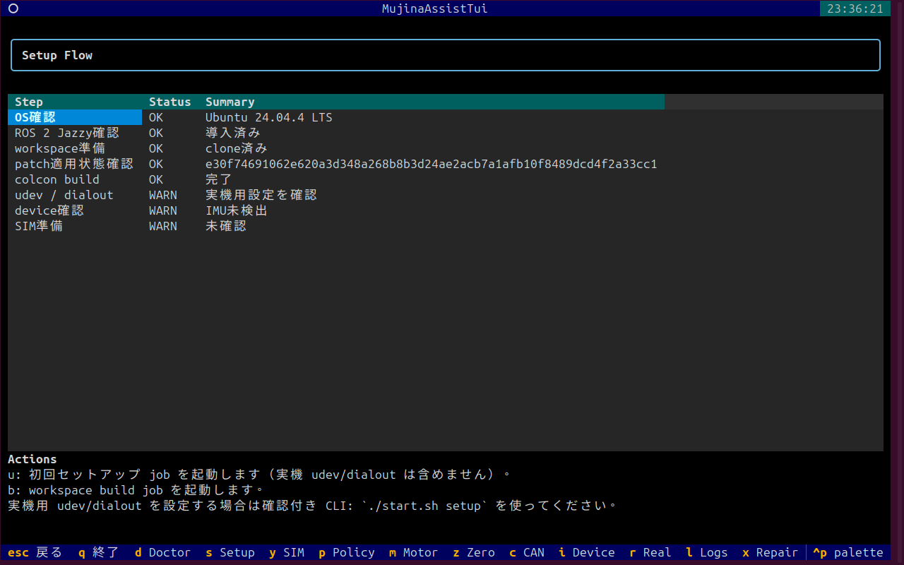
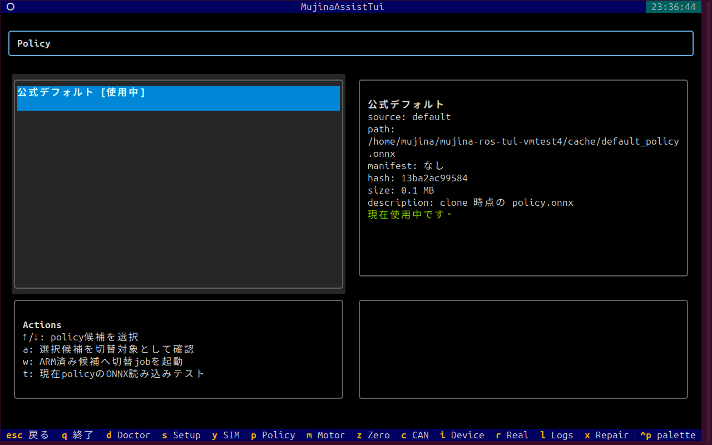
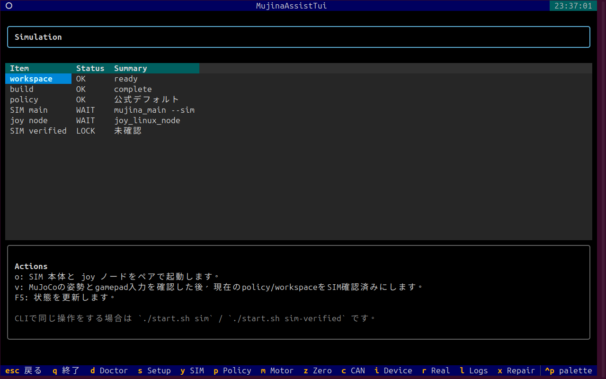
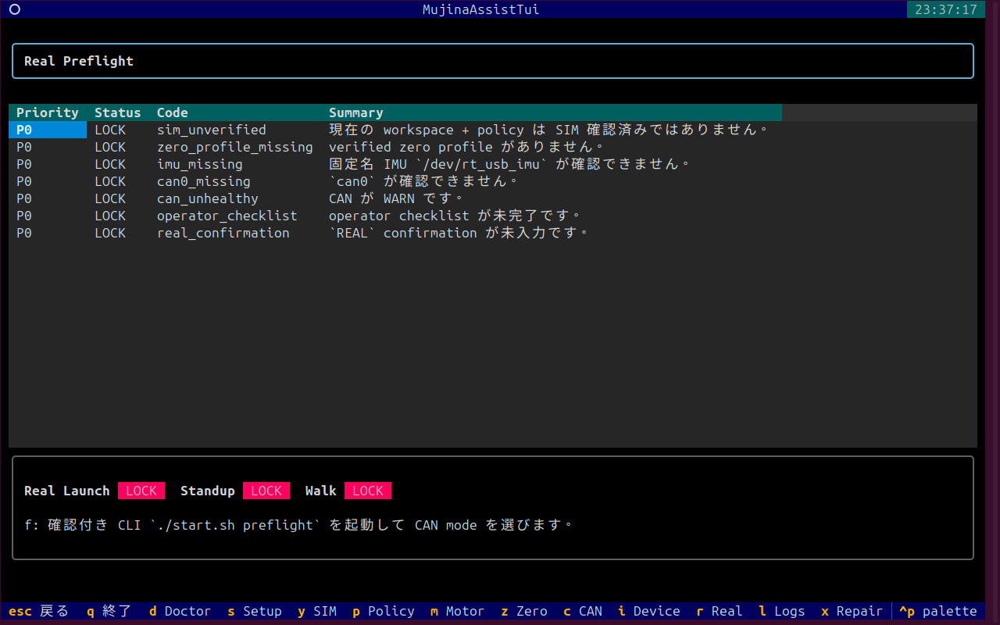
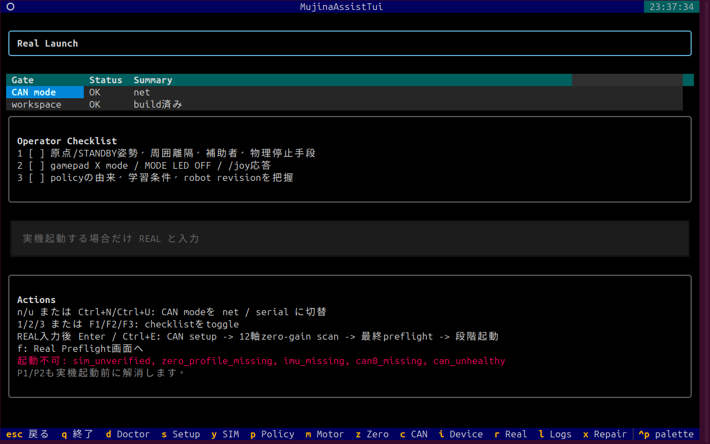
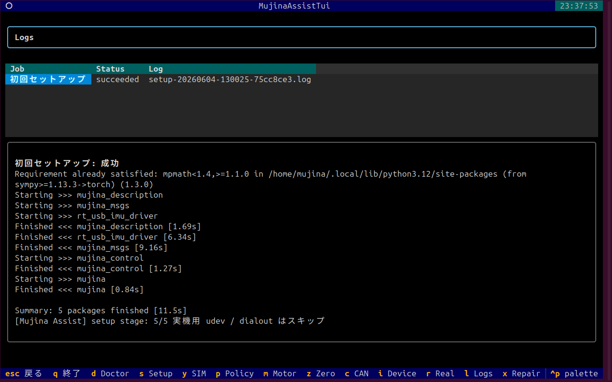
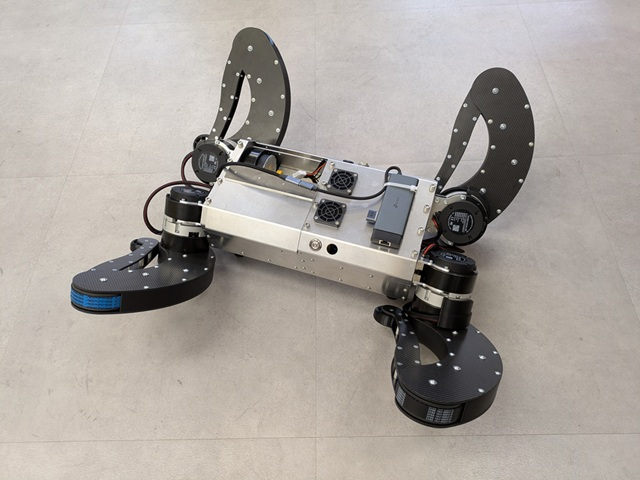
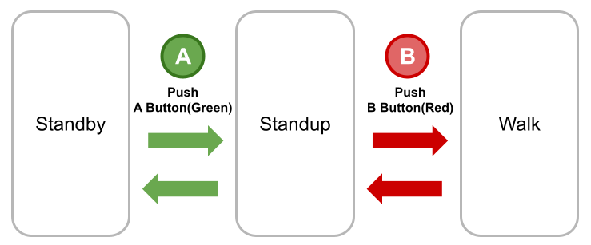

# mujina-ros-tui 画像付き使い方ガイド

このページは、Ubuntu 24.04上で `mujina-ros-tui` を初めて触る人が、できるだけ詰まらずにセットアップ、SIM確認、実機前確認まで進めるためのガイドです。

画像は Oracle VirtualBox 上の Ubuntu 24.04 VM で、実際に `./start.sh` を起動して撮ったスクリーンショットです。VMではIMU/CAN未接続なので、実機系の項目は `WARN` / `LOCK` になります。それは正常です。

## 最短ルート

まずはこれだけで始められます。

```bash
git clone https://github.com/Aero123421/mujina-ros-tui.git
cd mujina-ros-tui
./start.sh
```

状態だけ見たいとき:

```bash
./start.sh doctor
```

初回セットアップ:

```bash
./start.sh setup
```

TUIをもう一度開く:

```bash
./start.sh
```

## 画面全体の見方



起動直後はDashboardです。ここで最初に見る場所は3つです。

| 場所 | 見ること |
| --- | --- |
| 左上 `System` | workspace、build、policy、SIM確認が済んでいるか |
| 左中 `Real Launch Locks` | 実機起動を止めている理由 |
| 右下 `Doctor Checks` | OS、ROS、workspace、IMU、CAN、gamepad の状態 |

この画像では、workspaceとbuildはOKですが、SIM未確認、IMU未検出、CAN未検出です。VMで触っているなら自然な状態です。実機起動だけがロックされます。

下部のキー表示から画面を移動します。

| Key | 画面 |
| --- | --- |
| `d` | Dashboard / Doctor |
| `s` | Setup |
| `y` | Simulation |
| `p` | Policy |
| `m` | Motor |
| `z` | Zero |
| `c` | CAN |
| `i` | Device |
| `r` | Real Preflight |
| `l` | Logs |
| `x` | Repair |
| `q` | Quit |

Dashboard右上のFlow一覧は、矢印キーで選んで `Enter` でも開けます。Real Launch画面はこのFlow一覧から開くのが分かりやすいです。

## 1. Setup 画面



`s` でSetup画面を開きます。

見ること:

| 行 | 意味 |
| --- | --- |
| `OS確認` | Ubuntu 24.04か |
| `ROS 2 Jazzy確認` | ROS 2 Jazzyが入っているか |
| `workspace準備` | mujina_ros workspaceが作られているか |
| `patch適用状態確認` | assisted patchが当たっているか |
| `colcon build` | buildが完了しているか |
| `udev / dialout` | 実機デバイス権限の設定 |
| `device確認` | IMU/CANなどの検出 |
| `SIM準備` | SIM確認済みか |

操作:

| Key | 動作 |
| --- | --- |
| `u` | 初回セットアップjobを起動する。TUIの `u` は実機udev/dialout設定を含みません |
| `b` | workspace build jobを起動する |

VMで試すだけなら、`udev / dialout` や `device確認` が `WARN` でも先へ進めます。実機PCで権限設定まで行いたい場合は、確認付きCLIの `./start.sh setup` を使ってください。設定後に再ログインが必要になることがあります。

詰まりやすい点:

- `No space left on device` が出たら、VMのディスク容量不足です。Ubuntu側で空き容量を増やすか、VMを大きめに作り直してください。
- `ROS 2 Jazzy` がNGなら、`./start.sh setup` を再実行します。
- `colcon build` がNGなら、`l` のLogs画面で失敗ログを見ます。

## 2. Policy 画面



`p` でPolicy画面を開きます。

左側にpolicy候補、右側に詳細が出ます。候補は自動検出されます。

- 公式デフォルトpolicy
- cache済みpolicy
- USB上の `.onnx`

操作:

| Key | 動作 |
| --- | --- |
| `↑` / `↓` | policy候補を選択 |
| `a` | 選択候補を切替対象としてARM |
| `w` | ARM済み候補へ切替jobを起動 |
| `t` | 現在policyのONNX読み込みテスト |
| `F5` | USB/cache候補を再スキャン |

重要:

- USBや手動pathの外部policyは、manifest付きだけTUIからARM/切替できます。
- manifestなしの外部policyはTUIではARMできません。
- policyを切り替えると、SIM確認済み状態は無効になります。

詰まりやすい点:

- USBに `.onnx` を置いたのに出ない場合は、`F5` で再スキャンします。
- manifestなし外部policyを使いたい場合は、TUIではなく `./start.sh policy` で明示確認してください。
- 切替後は必ずSimulation画面でSIM確認をやり直してください。

## 3. Simulation 画面



`y` でSimulation画面を開きます。

見ること:

| 行 | 意味 |
| --- | --- |
| `workspace` | workspaceが準備済みか |
| `build` | build済みか |
| `policy` | SIM確認したいpolicy |
| `SIM main` | `mujina_main --sim` の状態 |
| `joy node` | gamepad入力ノードの状態 |
| `SIM verified` | 現在のworkspace + policyが確認済みか |

操作:

| Key | 動作 |
| --- | --- |
| `o` | SIM本体とjoyノードをペアで起動 |
| `v` | MuJoCo姿勢とgamepad入力を確認した後、SIM確認済みにする |
| `F5` | 状態更新 |

CLIで同じことをする場合:

```bash
./start.sh sim
./start.sh sim-verified
```

詰まりやすい点:

- `SIM verified` が `LOCK` のままなら、まだ確認済みになっていません。
- policyを変えた後は、以前のSIM確認は無効になります。
- gamepadが見えていても、MuJoCo上の姿勢と `/joy` 入力応答を見てから `v` を押してください。

## 4. Real Preflight 画面



`r` でReal Preflight画面を開きます。

ここは「なぜ実機起動できないのか」を見る画面です。`P0` は実機起動を止める強いロックです。

この画像では次の理由で止まっています。

- `sim_unverified`: 現在のworkspace + policyがSIM確認済みではない
- `zero_profile_missing`: verified zero profileがない
- `imu_missing`: `/dev/rt_usb_imu` がない
- `can0_missing`: `can0` がない
- `can_unhealthy`: CAN状態がWARN
- `operator_checklist`: operator checklist未完了
- `real_confirmation`: `REAL` 未入力

操作:

| Key | 動作 |
| --- | --- |
| `f` | 確認付きCLI `./start.sh preflight` を起動し、CAN modeを選ぶ |

詰まりやすい点:

- VMではIMU/CANがないので、`imu_missing` や `can0_missing` は自然です。
- 実機PCで出る場合は、配線、udev、CANアダプタ、`can0` setupを確認します。
- `sim_unverified` が残っている場合、まずSimulation画面でSIM確認を完了してください。

## 5. Real Launch 画面



Real Launch画面は、実機を段階起動するための画面です。Dashboard右上のFlow一覧でReal Launchを選んで `Enter` を押すと開けます。

この画面では、起動条件が揃っていない時に `起動不可` と表示されます。画像ではVMなので、SIM未確認、zero profileなし、IMU/CAN未接続で止まっています。

操作:

| Key | 動作 |
| --- | --- |
| `n` / `Ctrl+N` | CAN modeを `net` にする |
| `u` / `Ctrl+U` | CAN modeを `serial` にする |
| `1` / `F1` | 原点/STANDBY姿勢、周囲離隔、補助者、物理停止手段を確認 |
| `2` / `F2` | gamepad X mode、MODE LED OFF、`/joy` 応答を確認 |
| `3` / `F3` | policyの由来、学習条件、robot revisionを把握 |
| `Enter` / `Ctrl+E` | `REAL` 入力後に段階起動 |
| `f` | Real Preflight画面へ |

実機起動時の流れ:

1. stale job / 競合jobがないか確認
2. policy、manifest、SIM確認済み状態を確認
3. `/dev/rt_usb_imu`、CAN、gamepadを確認
4. CAN setupを実行
5. 12軸zero-gain motor scanを実行
6. 最終preflightを確認
7. IMU node → `mujina_main` → joy node の順で段階起動

安全上の大事な点:

- `REAL` と入力しない限り、起動jobは作られません。
- setup/build/policy切替/SIM/zero/motor readなど競合jobがある場合、実機起動は止まります。
- preflight中に競合jobが始まった場合も、段階起動には進みません。
- ROSのemergency stopは物理電源遮断ではありません。必ず独立した物理停止手段を用意してください。

## 6. Logs 画面



`l` でLogs画面を開きます。

ここでは、setup、build、policy切替、SIM起動、real launchなどのjob履歴とログ末尾を見られます。

詰まった時は、まずここを見ます。

| 状況 | 見る場所 |
| --- | --- |
| setupが途中で止まった | `初回セットアップ` のログ |
| buildが失敗した | `colcon build` のエラー |
| policy切替が失敗した | `policy_switch` job log |
| SIMやreal launchが起動しない | 対応するjob logとReal Preflight |

## 7. 原点姿勢とzeroの注意

本家 `mujina_ros` のzero書き込みは、自動で正しい初期姿勢へ戻す処理ではありません。人間がロボットを所定姿勢に置いた後、「今の姿勢をzeroとして保存する」操作です。



TUIのZero画面では、zero前のread-only queryを起動できます。原点書き込みそのものは確認付きCLIへ委譲します。

```bash
./start.sh zero
```

間違った姿勢でzeroを書き込むと、その間違いが原点として扱われます。実機が変な動きをした、CANやmotor IDが怪しい、姿勢が合っていない、という場合はzeroを書き直す前に `doctor`、`preflight`、motor read-only queryで切り分けてください。

## 8. Gamepad確認



実機前に見ること:

- X mode
- MODE LED OFF
- `/joy` が出ている
- axes/buttons数が期待通り

TUI上で `/dev/input/js0` が見えても、それだけで十分とは扱いません。Real Launch前に `/joy` の応答まで確認してください。

## 9. 壊れた状態から戻す

途中で閉じた、setupを止めた、SIMを止めた、jobが残った、という時はこの順で戻します。

```bash
./start.sh doctor
./start.sh repair
./start.sh doctor
```

`repair` はworkspaceを削除しません。stale job、古いclaim、ジョブ起動失敗由来の手動復旧フラグを整理します。

まだ分からない時は:

1. `l` でLogsを見る
2. `r` でReal Preflightを見る
3. `./start.sh doctor` の出力を見る
4. VMならIMU/CAN未接続は正常、と切り分ける

## 10. 実機へ進む前の最終チェック

実機でReal Launchへ進む前に、最低限これを満たしてください。

- Ubuntu 24.04 / ROS 2 Jazzy
- workspace/build OK
- policyの由来とmanifestを把握
- 同じworkspace + policyでSIM確認済み
- zero profile verified
- `/dev/rt_usb_imu` が固定名で見える
- CAN modeが合っている
- gamepad X mode / MODE LED OFF / `/joy` 応答OK
- 物理停止手段と補助者がいる
- Real PreflightのP0/P1/P2を理解している

TUIは「見落としを減らす補助」です。実機が動く場所、周囲の安全、電源遮断手段は必ず人間が確認してください。
