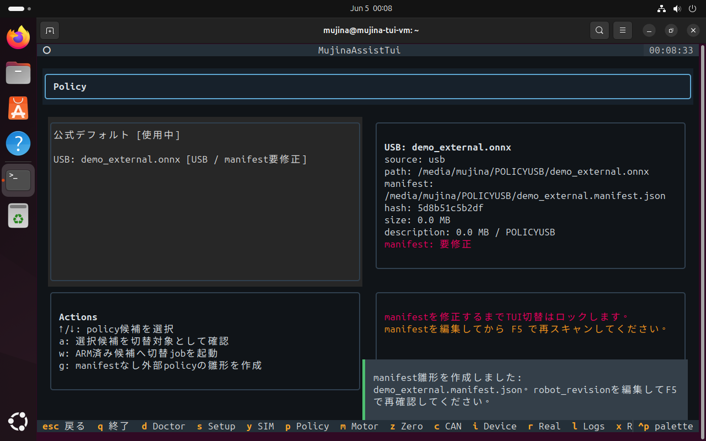

# mujina-ros-tui 画像付き使い方ガイド

このページは、Ubuntu 24.04上で `mujina-ros-tui` を初めて触る人が、できるだけ詰まらずにセットアップ、SIM確認、実機前確認まで進めるためのガイドです。

TUI画像は Oracle VirtualBox 上の Ubuntu 24.04 VM で、実際に `./start.sh` を起動して撮ったスクリーンショットです。VMではIMU/CAN未接続なので、実機系の項目は `WARN` / `LOCK` になります。それは正常です。

原点姿勢とgamepadの画像は、本家 `mujina_ros` の公式画像を引用しています。各画像の近くに出典を書いています。

## 最短ルート

まずはこれだけで始められます。

```bash
git clone https://github.com/Aero123421/mujina-ros-tui.git
cd mujina-ros-tui
./start.sh
```

状態だけ見たいとき:

```bash
./start.sh doctor
```

初回セットアップ:

```bash
./start.sh setup
```

TUIをもう一度開く:

```bash
./start.sh
```

## 画面全体の見方


起動直後はDashboardです。ここで最初に見る場所は3つです。

| 場所 | 見ること |
| --- | --- |
| 左上 `System` | workspace、build、policy、SIM確認が済んでいるか |
| 左中 `Real Launch Locks` | 実機起動を止めている理由 |
| 右下 `Doctor Checks` | OS、ROS、workspace、IMU、CAN、gamepad の状態 |

この画像では、workspaceとbuildはOKですが、SIM未確認、IMU未検出、CAN未検出です。VMで触っているなら自然な状態です。実機起動だけがロックされます。

下部のキー表示から画面を移動します。

| Key | 画面 |
| --- | --- |
| `d` | Dashboard / Doctor |
| `s` | Setup |
| `y` | Simulation |
| `p` | Policy |
| `m` | Motor |
| `z` | Zero |
| `c` | CAN |
| `i` | Device |
| `r` | Real Preflight |
| `l` | Logs |
| `x` | Repair |
| `q` | Quit |

Dashboard右上のFlow一覧は、矢印キーで選んで `Enter` でも開けます。Real Launch画面はこのFlow一覧から開くのが分かりやすいです。

## 1. Setup 画面


`s` でSetup画面を開きます。

見ること:

| 行 | 意味 |
| --- | --- |
| `OS確認` | Ubuntu 24.04か |
| `ROS 2 Jazzy確認` | ROS 2 Jazzyが入っているか |
| `workspace準備` | mujina_ros workspaceが作られているか |
| `patch適用状態確認` | assisted patchが当たっているか |
| `colcon build` | buildが完了しているか |
| `udev / dialout` | 実機デバイス権限の設定 |
| `device確認` | IMU/CANなどの検出 |
| `SIM準備` | SIM確認済みか |

操作:

| Key | 動作 |
| --- | --- |
| `u` | 初回セットアップjobを起動する。TUIの `u` は実機udev/dialout設定を含みません |
| `b` | workspace build jobを起動する |

VMで試すだけなら、`udev / dialout` や `device確認` が `WARN` でも先へ進めます。実機PCで権限設定まで行いたい場合は、確認付きCLIの `./start.sh setup` を使ってください。設定後に再ログインが必要になることがあります。

詰まりやすい点:

- `No space left on device` が出たら、VMのディスク容量不足です。Ubuntu側で空き容量を増やすか、VMを大きめに作り直してください。
- `ROS 2 Jazzy` がNGなら、`./start.sh setup` を再実行します。
- `colcon build` がNGなら、`l` のLogs画面で失敗ログを見ます。

## 2. Policy 画面


`p` でPolicy画面を開きます。

左側にpolicy候補、右側に詳細が出ます。候補は自動検出されます。

- 公式デフォルトpolicy
- cache済みpolicy
- USB上の `.onnx`

操作:

| Key | 動作 |
| --- | --- |
| `↑` / `↓` | policy候補を選択 |
| `a` | 選択候補を切替対象としてARM |
| `w` | ARM済み候補へ切替jobを起動 |
| `g` | manifestなし外部policyの雛形をONNXの隣に作成 |
| `t` | 現在policyのONNX読み込みテスト |
| `F5` | USB/cache候補を再スキャン |

重要:

- USBや手動pathの外部policyは、manifestを整えるとTUIからARM/切替できます。
- manifestなしの外部policyを選ぶと、画面右側に `g` とCLI fallbackが出ます。
- `g` で作るmanifestは下書きです。`robot_revision` を編集するまで切替できず、SIM確認後に `safety.real_world_approved=true` にするまで実機起動もできません。
- policyを切り替えると、SIM確認済み状態は無効になります。

画面で先に解消すること:

- USBに `.onnx` を置いたら、まず `F5` で再スキャンします。TUIは `/media/$USER` と `/run/media/$USER` 配下を探します。
- 候補に `manifestなし` が出たら、`g` で `.manifest.json` を作成します。
- manifestを編集して `F5` を押すと、`manifest` / `manifest要修正` / `実機未承認` が一覧で分かります。
- 切替後は必ずSimulation画面でSIM確認をやり直してください。

`g` で雛形を作ると、画面上でも `manifest要修正` と表示されます。この状態ではまだARMできません。



CLIでmanifest雛形だけ作る場合:

```bash
./start.sh policy --write-manifest-template /path/to/policy.onnx
```

作成後に確認する項目:

| 項目 | 何を見るか |
| --- | --- |
| `robot_revision` | 学習対象・実機revisionと一致するか |
| `input.shape` / `output.shape` | Mujina TUIが期待する `[1,45]` / `[1,12]` か |
| `joint_order` | Mujina既定の12軸順序か |
| `hash.onnx_sha256` | ONNXを差し替えていないか |
| `safety.real_world_approved` | SIM確認後、人間が実機投入可と判断した時だけ `true` |

## 3. Simulation 画面


`y` でSimulation画面を開きます。

見ること:

| 行 | 意味 |
| --- | --- |
| `workspace` | workspaceが準備済みか |
| `build` | build済みか |
| `policy` | SIM確認したいpolicy |
| `SIM main` | `mujina_main --sim` の状態 |
| `joy node` | gamepad入力ノードの状態 |
| `SIM verified` | 現在のworkspace + policyが確認済みか |

操作:

| Key | 動作 |
| --- | --- |
| `o` | SIM本体とjoyノードをペアで起動 |
| `v` | MuJoCo姿勢とgamepad入力を確認した後、SIM確認済みにする |
| `F5` | 状態更新 |

CLIで同じことをする場合:

```bash
./start.sh sim
./start.sh sim-verified
```

画面で先に解消すること:

- `SIM verified` が `LOCK` のままなら、まだ確認済みになっていません。
- policyを変えた後は、以前のSIM確認は無効になります。
- gamepadが見えていても、MuJoCo上の姿勢と `/joy` 入力応答を見てから `v` を押してください。

## 4. 実機PCでの準備手順

ここから先は、実機を動かすPCでの手順です。VMで試しているだけなら、IMU/CAN/gamepad が `WARN` / `LOCK` のままでも正常です。

実機では、TUIの画面を上から順にそろえます。途中で `P0` lock が残ったら、Real Launchには進みません。

TUIの `q`、job停止、ROS emergency stop は、物理電源遮断の代わりではありません。起動前に、手元で即座に切れる電源スイッチや非常停止、補助者の立ち位置、ロボット可動範囲、床面、ケーブルの逃げを確認してください。

### 4.1 Setup

1. 実機PCで repository を開きます。

```bash
cd mujina-ros-tui
./start.sh
```

2. `s` でSetup画面を開きます。
3. `workspace準備` と `colcon build` がOKであることを確認します。
4. 実機デバイス権限まで設定したい場合は、TUIの `u` ではなく確認付きCLIを使います。

```bash
./start.sh setup
```

5. `dialout` やudev ruleの設定後に再ログインが必要と表示されたら、Ubuntuから一度ログアウトして入り直します。

### 4.2 Device

1. `i` でDevice画面を開きます。
2. 次を確認します。

| 項目 | 期待する状態 |
| --- | --- |
| IMU | `/dev/rt_usb_imu` が見える |
| USB-CAN | serial CANを使う場合は `/dev/usb_can` が見える |
| Gamepad | `/dev/input/js0` が見える |

`/dev/ttyUSB*` や `/dev/ttyACM*` だけが見えて固定名がない場合、udev rule、USBの挿し直し、再ログインを確認します。固定名が出ないまま実機起動へ進むと、別デバイスをIMU/CANとして扱う危険があります。

### 4.3 CAN

1. `c` でCAN画面を開きます。
2. SocketCANとして直接 `can0` を使う接続なら `n`、USB serial CANアダプタを `/dev/usb_can` から `slcand` で `can0` にする接続なら `u` を押します。
3. `can0` が見えること、または `/dev/usb_can` から `can0` へ `slcand` が動いていることを確認します。

CAN setupは通信路の準備です。motorの動作確認は次のMotor画面でread-only queryとして分けて行います。

### 4.4 Motor

1. `m` でMotor画面を開きます。
2. network CANなら `n`、serial CANなら `u` で12軸 read-only queryを起動します。
3. `l` でLogs画面を開き、motor read job logを見ます。
4. 12軸のID、角度、応答が想定外なら、zeroやReal Launchへ進まず配線、CAN mode、motor IDを確認します。

このread-only queryは、Real Launch前に「通信が見えているか」「座標やIDが大きく崩れていないか」を見るためのものです。ここで違和感がある場合は、実機を動かす前に止めます。

### 4.5 Zero

1. `z` でZero画面を開きます。
2. zero前のread-only queryで現在姿勢を確認します。
3. ロボットを本家READMEの原点姿勢に物理的に置きます。左右、前後、脚の向き、膝の折れ方向を参考画像と照合します。
4. 原点を書き込む場合は、確認付きCLIを使います。

```bash
./start.sh zero
```

zeroは自動原点復帰ではありません。人間が置いた現在姿勢をzeroとして保存します。姿勢を間違えたままzeroを書くと、その間違いが原点になります。

### 4.6 Policy と SIM

1. `p` でPolicy画面を開きます。
2. 外部policyならmanifestを整え、`manifest要修正` が消えていることを確認します。
3. policyを切り替えたら `y` でSimulation画面を開き、`o` でSIMを起動します。
4. MuJoCo上の姿勢、gamepad入力、`/joy` 応答を確認してから `v` でSIM確認済みにします。gamepadはX mode、MODE LED OFFを確認し、スティックやボタン入力が `/joy` に出ることを見ます。
5. 実機投入するpolicyだけ、manifestの `safety.real_world_approved` を `true` にします。

`real_world_approved=true` は「TUIが自動で安全判定した」という意味ではありません。人間が学習条件、robot revision、SIM挙動、周囲の安全を確認したという印です。

### 4.7 Real Preflight

1. `r` でReal Preflight画面を開きます。
2. `P0` が残っていないか確認します。
3. `f` を押すと確認付きCLI `./start.sh preflight` が開き、CAN modeを選んでpreflightを再確認できます。

`sim_unverified`、`zero_profile_missing`、`imu_missing`、`can0_missing`、`serial_can_missing`、`serial_can0_missing`、`slcand_missing`、`can_unhealthy` が残っている場合は、Real Launchへ進まず該当画面へ戻ります。

### 4.8 Real Launch

1. Dashboardに戻る場合は `d` を押します。
2. 右上のFlow一覧で `Real Launch` を選び、`Enter` を押します。
3. CAN modeを選びます。

| Key | CAN mode |
| --- | --- |
| `n` / `Ctrl+N` | network CAN |
| `u` / `Ctrl+U` | serial CAN |

4. operator checklistを1つずつ確認します。

| Key | 確認すること |
| --- | --- |
| `1` / `F1` | 原点/STANDBY姿勢、周囲離隔、補助者、物理停止手段 |
| `2` / `F2` | gamepad X mode、MODE LED OFF、`/joy` 応答 |
| `3` / `F3` | policyの由来、学習条件、robot revision |

キーを押すとチェック欄が `[x]` に変わります。3項目すべてが `[x]` になるまで、実機起動操作は完了扱いになりません。

5. 入力欄に `REAL` と入力します。`REAL` は「ここからCAN setup、motor scan、最終preflight、段階起動へ進む」ための最後の明示確認です。
6. `Enter` / `Ctrl+E` で段階起動します。

Real Launch jobは、起動直前にもう一度安全確認を行います。流れは次の通りです。

1. stale job / 競合job確認
2. policy、manifest、SIM確認済み状態確認
3. `/dev/rt_usb_imu`、CAN、gamepad確認
4. CAN setup
5. 12軸 zero-gain motor scan
6. 最終preflight
7. IMU node → `mujina_main` → joy node の順で段階起動

起動しない場合や途中で止まる場合は、`l` でLogs画面を開き、real launch job logを確認します。実機が意図しない動きをした場合は、TUI上の操作より先に物理停止手段で止めてください。TUIを閉じることと、実機の電源やトルクを安全に止めることは同じではありません。

## 5. Real Preflight 画面


`r` でReal Preflight画面を開きます。

ここは「なぜ実機起動できないのか」を見る画面です。`P0` は実機起動を止める強いロックです。

この画像では次の理由で止まっています。

- `sim_unverified`: 現在のworkspace + policyがSIM確認済みではない
- `zero_profile_missing`: verified zero profileがない
- `imu_missing`: `/dev/rt_usb_imu` がない
- `can0_missing`: `can0` がない
- `serial_can_missing`: serial CAN用の `/dev/usb_can` がない
- `serial_can0_missing` / `slcand_missing`: `/dev/usb_can` から `can0` を作る `slcand` が動いていない
- `can_unhealthy`: CAN状態がWARN
- `operator_checklist`: operator checklist未完了
- `real_confirmation`: `REAL` 未入力

操作:

| Key | 動作 |
| --- | --- |
| `f` | 確認付きCLI `./start.sh preflight` を起動し、CAN modeを選ぶ |

詰まりやすい点:

- VMではIMU/CANがないので、`imu_missing` や `can0_missing` は自然です。
- 実機PCで出る場合は、配線、udev、CANアダプタ、`can0` setupを確認します。serial CANなら `/dev/usb_can` と `slcand` も確認します。
- `sim_unverified` が残っている場合、まずSimulation画面でSIM確認を完了してください。

## 6. Real Launch 画面


Real Launch画面は、実機を段階起動するための画面です。Dashboard右上のFlow一覧でReal Launchを選んで `Enter` を押すと開けます。

この画面では、起動条件が揃っていない時に `起動不可` と表示されます。画像ではVMなので、SIM未確認、zero profileなし、IMU/CAN未接続で止まっています。

操作:

| Key | 動作 |
| --- | --- |
| `n` / `Ctrl+N` | CAN modeを `net` にする |
| `u` / `Ctrl+U` | CAN modeを `serial` にする |
| `1` / `F1` | 原点/STANDBY姿勢、周囲離隔、補助者、物理停止手段を確認 |
| `2` / `F2` | gamepad X mode、MODE LED OFF、`/joy` 応答を確認 |
| `3` / `F3` | policyの由来、学習条件、robot revisionを把握 |
| `Enter` / `Ctrl+E` | `REAL` 入力後に段階起動 |
| `f` | Real Preflight画面へ |

実機起動時の流れ:

1. stale job / 競合jobがないか確認
2. policy、manifest、SIM確認済み状態を確認
3. `/dev/rt_usb_imu`、CAN、gamepadを確認
4. CAN setupを実行
5. 12軸zero-gain motor scanを実行
6. 最終preflightを確認
7. IMU node → `mujina_main` → joy node の順で段階起動

安全上の大事な点:

- `REAL` と入力しない限り、起動jobは作られません。
- setup/build/policy切替/SIM/zero/motor readなど競合jobがある場合、実機起動は止まります。
- preflight中に競合jobが始まった場合も、段階起動には進みません。
- ROSのemergency stopは物理電源遮断ではありません。必ず独立した物理停止手段を用意してください。

## 7. Logs 画面


`l` でLogs画面を開きます。

ここでは、setup、build、policy切替、SIM起動、real launchなどのjob履歴とログ末尾を見られます。

起動や切替が止まった時は、まずここを見ます。

| 状況 | 見る場所 |
| --- | --- |
| setupが途中で止まった | `初回セットアップ` のログ |
| buildが失敗した | `colcon build` のエラー |
| policy切替が失敗した | `policy_switch` job log |
| SIMやreal launchが起動しない | 対応するjob logとReal Preflight |

## 8. 原点姿勢とzeroの注意

本家 `mujina_ros` のzero書き込みは、自動で正しい初期姿勢へ戻す処理ではありません。人間がロボットを所定姿勢に置いた後、「今の姿勢をzeroとして保存する」操作です。


出典: 本家 `mujina_ros` 公式画像 `third_party/mujina_ros/media/robot-pose-to-calib-motor-origin.jpg`。Upstream: https://github.com/rt-net/mujina_ros 。Vendored commit: `38ff97f12d0ef424dd7fc840d3ce7a1ebad2a49d`。License: MIT License、`third_party/mujina_ros/LICENSE` と `THIRD_PARTY_NOTICES.md` を参照。Copyright (c) 2024 Kento Kawaharazuka, 2025 CoRE-MA-KING, 2026 RT Corporation.

TUIのZero画面では、zero前のread-only queryを起動できます。原点書き込みそのものは確認付きCLIへ委譲します。

```bash
./start.sh zero
```

間違った姿勢でzeroを書き込むと、その間違いが原点として扱われます。実機が変な動きをした、CANやmotor IDが怪しい、姿勢が合っていない、という場合はzeroを書き直す前に `doctor`、`preflight`、motor read-only queryで切り分けてください。

## 9. Gamepad確認


出典: 本家 `mujina_ros` 公式画像 `third_party/mujina_ros/media/gamepad_mode_transition.png`。Upstream: https://github.com/rt-net/mujina_ros 。Vendored commit: `38ff97f12d0ef424dd7fc840d3ce7a1ebad2a49d`。License: MIT License、`third_party/mujina_ros/LICENSE` と `THIRD_PARTY_NOTICES.md` を参照。Copyright (c) 2024 Kento Kawaharazuka, 2025 CoRE-MA-KING, 2026 RT Corporation.

実機前に見ること:

- X mode
- MODE LED OFF
- `/joy` が出ている
- axes/buttons数が期待通り

TUI上で `/dev/input/js0` が見えても、それだけで十分とは扱いません。Real Launch前に `/joy` の応答まで確認してください。

## 10. 壊れた状態から戻す

途中で閉じた、setupを止めた、SIMを止めた、jobが残った、という時はこの順で戻します。

```bash
./start.sh doctor
./start.sh repair
./start.sh doctor
```

`repair` はworkspaceを削除しません。stale job、古いclaim、ジョブ起動失敗由来の手動復旧フラグを整理します。

まだ分からない時は、この順で画面上の状態をそろえます:

1. `l` でLogsを見る
2. `r` でReal Preflightを見る
3. `./start.sh doctor` の出力を見る
4. VMならIMU/CAN未接続は正常、と切り分ける

## 11. 実機へ進む前の最終チェック

実機でReal Launchへ進む前に、最低限これを満たしてください。

- Ubuntu 24.04 / ROS 2 Jazzy
- workspace/build OK
- policyの由来とmanifestを把握
- 同じworkspace + policyでSIM確認済み
- zero profile verified
- `/dev/rt_usb_imu` が固定名で見える
- CAN modeが合っている
- gamepad X mode / MODE LED OFF / `/joy` 応答OK
- 物理停止手段と補助者がいる
- Real PreflightのP0/P1/P2を理解している

TUIは「見落としを減らす補助」です。実機が動く場所、周囲の安全、電源遮断手段は必ず人間が確認してください。
